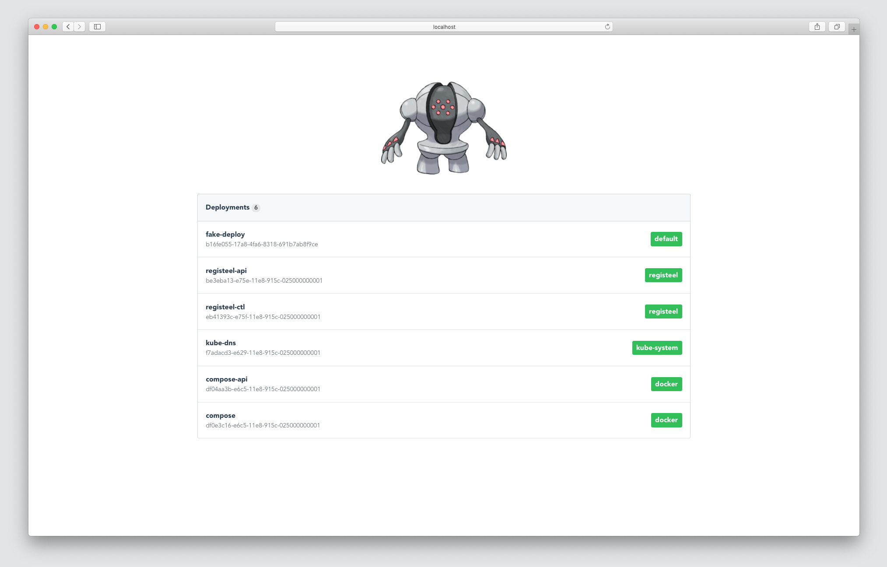
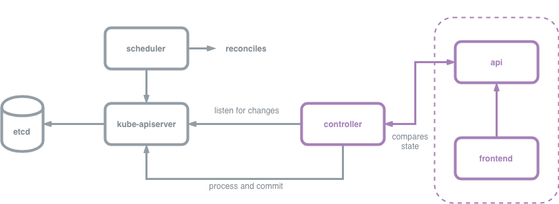

# Registeel



> Tempered by pressure underground over tens of thousands of years, its body cannot be scratched.

This is a simple app that demonstrates how to build a simple Kubernetes controller. It sends metadata about pods to a mock api service which a frontend then queries and displays information from. 

 **NOTE: This project is a proof of concept and is meant to serve as a reference**

- */api* - this is a simple [json-server](https://github.com/typicode/json-server) that is meant as a mock data store that controllers can be tested against
- */config* - holds the kubernetes deployment as a well as a test nginx deployment for showing how the controller updates 
- */vendor* - holds `dep` dependencies for controller
- */web* - simple vue.js frontend that contacts the api backend 

## Architecture

Here is a simple diagram of the architecture of this project.



## Deploying

```
kubectl apply -f config/deploy/namespace.yaml
kubectl apply -f config/deploy/rbac.yaml
kubectl apply -f config/deploy/api.yaml
kubectl apply -f config/deploy/ctl.yaml
```

This will run the web app portion. **NOTE: I haven't found a way to run this on Kubernetes and get service discovery working, I also am really bad at Javascript so who knows.**

```
make vuesetup
cd web && npm run serve
```
